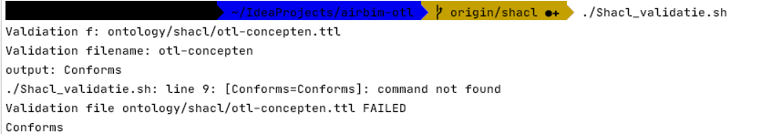
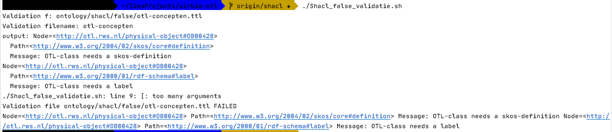

# airbim-otl

This repository contains (for now) the development of the RWS-OTL. This is mainly for demonstration purpose, showing how such a OTL could be used, how tooling can support the ontology development and how can be colaborated using git.

## Getting started
For instruction on how to use the repository, see [getting started](https://github.com/RWS-NL/airbim-otl/wiki/Getting-started) on the wiki.

## Validation 

 For validation use shacl in Jena Library. Check validation by shacl run:
 
 ./Shacl_validation.sh
 Result:
 
  
  Or for false example:
  ./Shacle_false_validation.sh
  Result:
  